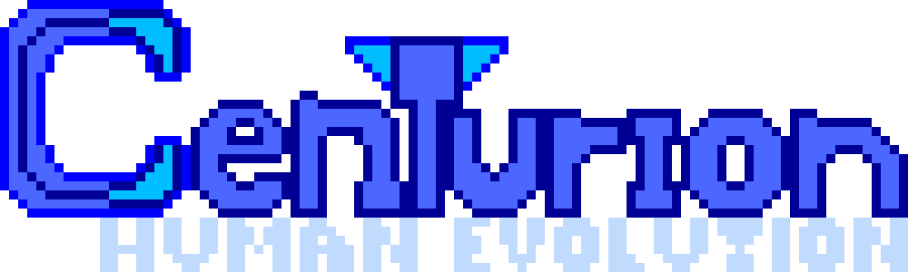
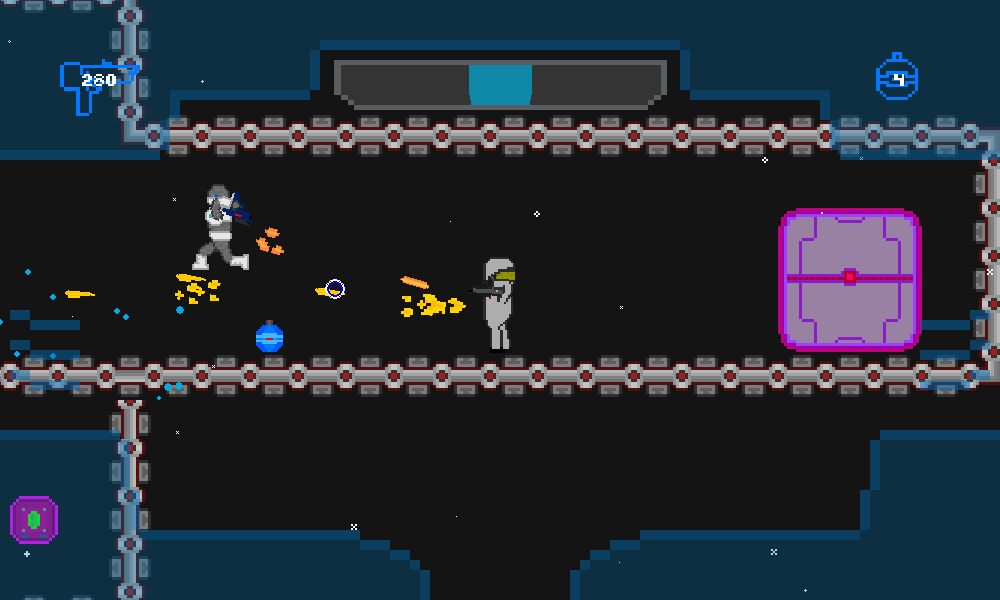

A science fiction platform shooter inspired by Halo and Super Metroid.

Take command of a human grunt as he fights his way through an intergalactic war against an evil race of aliens known as Renegades!
- Play through the story mode campaign and collect weapons!
- Play against bots in deathmatch arenas.
- Challenge your friends over local multiplayer.

# Dependencies

Just Pygame. This project was just a learning exercise for me (started when I was about 13).
Almost everything was written from scratch, including networking code.

# TODO

- Finish migrating the source to Python 3 (this was originally written in Python 2).
- Maybe add online multiplayer? Who knows. Local multiplayer is barely functional at the moment, so I'll have to see.